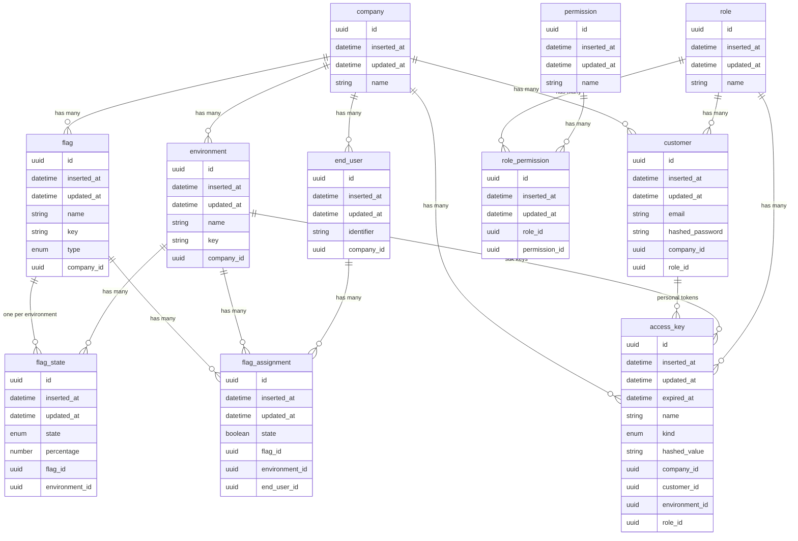

# Database Model

All ids are UUIDv7. All tables have `inserted_at` / `updated_at` (omitted below for brevity in comments only — they are listed). Unique constraints are enforced at the database level.

## Unique constraints (database-enforced)
- `environment (company_id, key)`
- `flag (company_id, key)`
- `flag_state (flag_id, environment_id)`
- `flag_assignment (flag_id, environment_id, end_user_id)`
- `end_user (company_id, identifier)`
- `customer (email)`
- `role (name)`, `permission (name)`, `role_permission (role_id, permission_id)`

## Deletion rules
- Deleting a flag cascades its states and assignments.
- Deleting an environment cascades its states, assignments, and sdk keys; the last environment of a company cannot be deleted.
- Deleting a customer cascades their personal access keys.
- Roles and permissions are seed data; not deletable via API.
