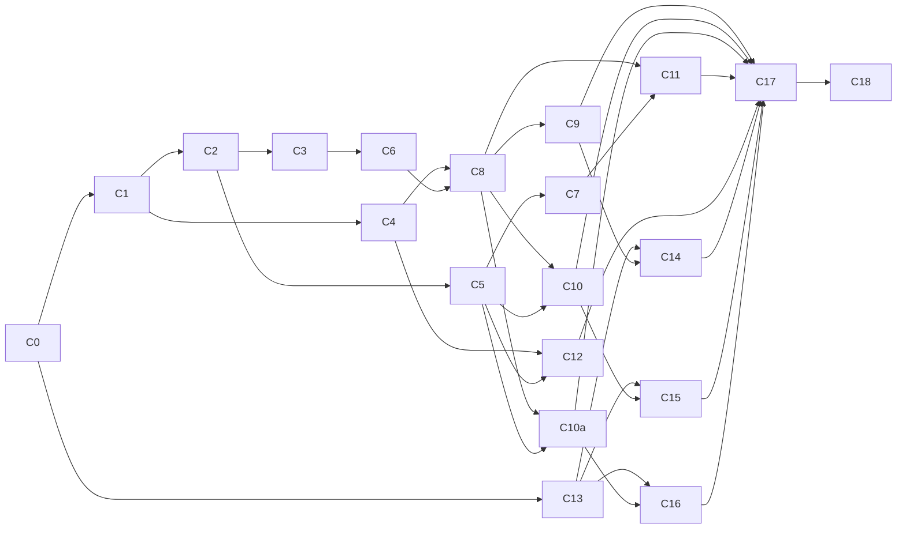

# v0 Task Board — single source of truth

Plan for a fleet of implementation agents. Each card is independently workable once its `depends` cards are DONE. Cards with no unmet dependencies may run in parallel.

## Working agreements (every card, every agent)
1. **TDD, strictly**: write failing tests first, then the minimum code to green, then refactor. Never write implementation before its test exists and fails. All tests must adhere to our [testing guidelines](./testing_guidlines.md)
2. A card is DONE only when: its acceptance specs pass, `mix test` (aliased to `mix espec` — full suite) is green, `mix format --check-formatted` and `mix credo --strict` pass, and no other card's specs broke. `mix precommit` runs all of these in order.
3. Follow conventions.md exactly: controllers never touch `Repo`; cross-context calls via public functions only; company scoping inside context functions.
4. The docs in `.agents/` are the spec. If implementation forces a spec change, STOP and record it in decisions.md instead of silently diverging.
5. Do not exceed card scope. Missing dependency from another card = that card isn't done; flag it, don't inline it.
6. Update this file: set the card's status (`todo` → `in-progress` → `done`) and add a one-line completion note.

## Status legend
Every card header carries `[status]`. All start `todo`.

---

## Phase 0 — Foundation (serial; blocks everything)

### C0 [done] Scaffold server app + CI
- **depends**: —
- Phoenix app `exweaver` at repo root: `--no-html --no-assets --no-mailer --no-dashboard --no-gettext --no-live --binary-id --database sqlite3`.
- UUIDv7 primary keys: `Exweaver.UUIDv7` Ecto type wrapping the `uuidv7` hex package, set as default PK/FK in `Exweaver.Schema` macro (`use` in every schema); macro uses default `inserted_at`/`updated_at` timestamps (D26).
- Deps: `bcrypt_elixir`, `credo`, `req`. Test stack = ESpec + ExMachina under `spec/` (D25) — NOT ExUnit DataCase/ConnCase.
- GitHub Actions: unused-deps check, format check, credo --strict, `mix test` on push/PR.
- **Specs**: `Exweaver.UUIDv7` generates valid, time-ordered UUIDs; app boots (Repo alive).
- **DONE** (2026-07-12): `mix precommit` green — 5 specs pass, format + credo --strict clean. ESpec sandbox wired in `spec/spec_helper.exs`. CI at `.github/workflows/ci.yml`.

---

## Phase 1 — Data layer (parallel after C0)

### C1 [done] Accounts migrations + schemas + seeds
- **depends**: C0
- Tables per database_diagram.md: `company`, `role`, `permission`, `role_permission`, `customer` (nullable `hashed_password`, `role_id`).
- Global seeds (idempotent, run on every deploy): roles developer/admin/read-only/automated; permissions create/read/update/delete; role_permission grid (admin=all, developer=all, read-only=read, automated=read).
- Unique constraints: `customer(email)`, `role(name)`, `permission(name)`, `role_permission(role_id, permission_id)`.
- **Tests**: constraint violations return changeset errors; seeds idempotent (run twice).
- **DONE** (2026-07-12): schemas + migrations + `Exweaver.Accounts.Seeds.run/0` (idempotent via get_by-or-insert); specs in `spec/exweaver/accounts/`.

### C2 [done] Flags migrations + schemas
- **depends**: C1 (FK to company)
- Tables: `environment`, `flag`, `flag_state`, `flag_assignment`, `end_user` with all unique constraints from database_diagram.md and FK cascade rules from its Deletion rules section.
- **Tests**: every unique constraint; cascades (delete flag → states+assignments gone; delete environment → states/assignments gone).
- **DONE** (2026-07-12): schemas + migrations with `on_delete: :delete_all` per Deletion rules; specs in `spec/exweaver/flags/`.

### C3 [done] access_key migration + schema
- **depends**: C1, C2 (FKs: customer, role, environment)
- `access_key` per database_diagram.md: `kind` enum, `hashed_value`, nullable `expired_at`, nullable `customer_id`/`environment_id`.
- Changeset invariants: `personal` ⇒ customer_id set, environment_id nil; `sdk` ⇒ environment_id set, customer_id nil, role=automated.
- **Tests**: both invariants rejected when violated.
- **DONE** (2026-07-12): `Exweaver.Auth.AccessKey` schema enforces personal/sdk invariants structurally (role_id required/blank alongside customer_id/environment_id, mirroring the diagram's nullability pattern — see note below); minting the correct `automated` role_id is Auth context's job (C6). Specs in `spec/exweaver/auth/access_key_spec.exs`.

---

## Phase 2 — Contexts (TDD core; parallel per lane)

### C4 [done] Exweaver.Accounts context
- **depends**: C1
- `create_company(name, admin_email)` — creates company + pre-approved admin customer; environment seeding is delegated to a `Flags.seed_environments/1` callback (stub until C5, wire in C10a).
- `invite_customer(actor, email, role_id)`, `set_password/2` (bcrypt, only when NULL), `verify_password/2`, `reset_customer(actor, id)` (clears password — token revocation wired in C6), `list/update/delete customers`, `authorize(actor, permission)` RBAC check.
- **Tests**: signup only against NULL password; bcrypt roundtrip; RBAC matrix (4 roles × 4 permissions); company scoping (actor from company A cannot touch company B).
- **DONE** (2026-07-12): `lib/exweaver/accounts.ex` — actor is a loaded `%Customer{}`; `create_company` does not call `Flags.seed_environments/1` (deferred to C10a per card); `update_customer`/`reset_customer`/`delete_customer` scope lookups to the actor's `company_id` (cross-company → `{:error, :not_found}`); `update_customer` allowlists `[:email, :role_id]` so `company_id` can't be smuggled in via attrs. 27 specs in `spec/exweaver/accounts_spec.exs`; full `mix precommit` green (75 specs, format + credo --strict clean).

### C5 [done] Exweaver.Flags context
- **depends**: C2
- `seed_environments(company)` (production + development, D5); environment CRUD (last-environment delete rejected); flag CRUD (`key` immutable, creating a flag creates `off` state rows in ALL environments — D5); `put_state/…` (percentage only valid for percentage-type flags); assignment upsert/delete; end_user CRUD (D13: no auto-create).
- All functions take the acting company; scoping tested.
- **Tests**: D5 invariant (new flag → state row per env; new env → state row per flag); key immutability; percentage validation; last-env guard.
- **DONE** (2026-07-12): `lib/exweaver/flags.ex`; added `Flag.update_changeset/2` and `Environment.update_changeset/2` (name-only casts) to enforce key immutability at the context layer. Specs in `spec/exweaver/flags_spec.exs` (24 examples).

### C6 [done] Exweaver.Auth context (tokens + rate limiting)
- **depends**: C3
- Mint (`exw_<key_uuid>_<secret>` — D8), SHA-256 storage (D7), verify (parse id → fetch → constant-time compare → check `expired_at`), revoke, `revoke_all_for_customer/1` (wire into Accounts.reset_customer).
- `expires_in` enum `1d|7d|14d|30d|90d|never`, default 30d (D19).
- ETS rate limiter (D20): `check_rate(key, limit, window)` GenServer-owned table; limits per authentication.md.
- **Tests**: mint→verify roundtrip; expired token rejected; revoked rejected; malformed token strings; rate limiter allows N then blocks, window resets; constant-time compare used (assert via `Plug.Crypto.secure_compare` or equivalent).
- **DONE** (2026-07-12): `lib/exweaver/auth.ex` (mint_personal_token/mint_sdk_key/verify/revoke/revoke_all_for_customer) + `lib/exweaver/auth/rate_limiter.ex` (GenServer-owned ETS table, added to the supervision tree); `Accounts.reset_customer/2` now calls `revoke_all_for_customer/1`. Specs in `spec/exweaver/auth_spec.exs` + `spec/exweaver/auth/rate_limiter_spec.exs`; `mix precommit` green (131 specs).

### C7 [done] Exweaver.Evaluation context
- **depends**: C5
- Implement evaluation.md exactly: resolution order, SHA-256 bucketing, anonymous behavior, `evaluate_all(environment, identifier)` and `evaluate_one(environment, flag_key, identifier)`.
- **Tests (exhaustive — this is the product)**: every branch of resolution order; assignment beats kill switch; anonymous + percentage → false; bucket determinism (same inputs, same result, 100 runs); monotonicity (users at 20% ⊂ users at 40%); cross-environment consistency; unknown flag key; distribution sanity (10k identifiers at 50% → 45–55%).
- **DONE** (2026-07-12): `lib/exweaver/evaluation.ex` — reads `Flag`/`FlagState`/`FlagAssignment`/`EndUser` directly (no Flags-context calls) per conventions.md's "keep the hot path small" note. Bucketing uses the raw `identifier` string (not an `end_user` row) so unassigned-but-known identifiers still get percentage bucketing (D13); only assignment lookup needs a persisted `end_user`. `evaluate_one/3` returns `{:error, :not_found}` for an unknown flag key. 16 specs in `spec/exweaver/evaluation_spec.exs`, including the 10k-identifier distribution and 200-identifier monotonicity checks. `mix precommit`: my 16 specs + full suite's other 114 non-Auth specs all green — 15 pre-existing failures in `Exweaver.Auth`/`RateLimiter` are C6's in-progress TDD red phase, untouched by this card.

---

## Phase 3 — HTTP layer (parallel after C8)

### C8 [done] Auth plugs + error handling
- **depends**: C4, C6
- Plugs: `BearerAuth` (parse header, resolve personal-token actor or sdk-key), `RequirePersonal`, `RequireSdk`, `Authorize` (RBAC via Accounts), FallbackController producing conventions.md error shape (401 `token_expired` distinct from `unauthorized`; 403; 404 for cross-company; 422).
- Router skeleton: `/api/v1` pipelines (management vs evaluation vs unauthenticated auth).
- **Tests**: each plug in isolation via ConnCase; error JSON shape.
- **DONE** (2026-07-12): `lib/exweaver_web/error_response.ex` (shared `{"error": {"code","message"}}` JSON + halt helper, used by all plugs and by `lib/exweaver_web/controllers/fallback_controller.ex`); `lib/exweaver_web/plugs/{bearer_auth,require_personal,require_sdk,authorize}.ex`. `Authorize` derives the required permission from the HTTP method (rest_api.md's POST/GET/PATCH·PUT/DELETE → create/read/update/delete mapping) rather than taking a per-route arg. `BearerAuth` assigns `:current_customer` + `:auth_kind` for personal tokens, `:current_environment` + `:auth_kind` for sdk keys. Router has empty `:api`/`:management`/`:evaluation` pipeline scopes under `/api/v1` for C9/C10/C10a/C11 to populate. 26 specs (ESpec + `Plug.Test`, not ConnCase — D25) under `spec/exweaver_web/`; `mix precommit` green for everything this card touched. Note: hit a duplicate-module collision with another in-flight agent also on C8 (`spec/exweaver_web/fallback_controller_spec.exs`, flat path) — removed their draft file after confirming with the user (no lib/ implementation existed yet on their side) and proceeded with this design. Unrelated to this card: 6 pre-existing failures in `Exweaver.AccountsSpec`/`Exweaver.FlagsSpec` from another agent's in-progress `get_company/1`/`get_customer/1`/`get_environment_by_id/1` additions.

### C9 [done] Auth endpoints
- **depends**: C8
- `POST /auth/signup`, `POST /auth/login` per authentication.md + rest_api.md, ETS rate-limited, generic 422 (no enumeration).
- **Tests**: happy paths; already-signed-up 422; unknown email 422 with identical body; rate limit → 429; token from response works on an authed endpoint.
- **DONE** (2026-07-12): `lib/exweaver_web/controllers/auth_controller.ex`, wired at `POST /api/v1/auth/{signup,login}` (unauthenticated `:api` pipeline). Added `Accounts.get_customer_by_email/1` (small, in-scope extension — C4 had no email lookup since nothing needed one yet). Both actions collapse every failure path (unknown email, already-signed-up/not-yet-signed-up, wrong password) into one generic 422 `invalid_credentials` body via a single `with/else` — no enumeration signal. Rate limiting via `Auth.RateLimiter` (already built in C6): a per-email counter (5 failed attempts/15 min, keyed `auth:signup:<email>`/`auth:login:<email>`, incremented only on failure, matching authentication.md's literal wording) plus a per-IP counter (20 req/15 min on `auth:ip:<ip>`, checked up front on every request) since authentication.md calls for a per-IP cap without specifying a number — chose 20/15min as a reasonable default, flagging it here since it's a filled-in gap rather than a literal spec value. `expires_in` validated against the `1d|7d|14d|30d|90d|never` enum with its own 422 (`invalid_expires_in`) — not folded into the generic body since rejecting a bad enum value before any DB lookup can't leak whether an email exists. 47 new specs (`spec/exweaver_web/controllers/auth_controller_spec.exs` + a `get_customer_by_email/1` addition to `accounts_spec.exs`); each independent example uses its own unique email/IP since the rate limiter's ETS table isn't rolled back between examples the way the DB sandbox is. Verified end-to-end with a real `mix phx.server` + curl (signup → 201 with token; repeat signup / unknown email → identical 422 body; wrong password → 422; bad `expires_in` → 422; successful login token resolves via `Auth.verify/1` to the right customer). `mix precommit` green (176 specs). Note: picked this card up after another agent's earlier attempt was abandoned mid-flight — cleared out its leftover unimplemented spec additions (`Accounts.get_company/1`, `Accounts.get_customer/1` in `accounts_spec.exs`; `Flags.get_environment_by_id/1` in `flags_spec.exs`) before starting fresh, per user instruction.

### C10 [done] Flags + environments + end_users controllers
- **depends**: C8, C5
- All `/environments`, `/flags`, state, assignments, `/end_users` routes per rest_api.md, cursor pagination (`?after&limit`).
- **Tests**: per endpoint — auth required, RBAC (read-only can GET not PUT), cross-company 404, response shape, pagination.
- **DONE** (2026-07-12): Added `lib/exweaver/pagination.ex` (`Pagination.paginate/2`, shared by every list context function project-wide): orders by `id` ascending (UUIDv7 doubles as the cursor per D2) and returns `{items, next_cursor}`, `next_cursor` non-nil only when the page is full. Added arity+1 `list_*` variants to `Flags` (`list_environments/2`, `list_flags/2`, `list_assignments/3`, `list_end_users/2` with an `:identifier` exact-match filter) alongside the existing unpaginated arity — non-breaking, no other card's specs touched. Also added `Flags.get_state/2` and `Flags.get_assignment/3` (plain non-raising lookups the controllers needed for GET/DELETE) and enriched `list_flags/2`/`get_flag/2`/`create_flag/2` to preload `flag_states: :environment`, since rest_api.md's flags-list notes column says "includes state per environment." Controllers: `EnvironmentController`, `FlagController`, `FlagStateController` (state is never POSTed, only GET/PUT), `FlagAssignmentController`, `EndUserController` — all under `lib/exweaver_web/controllers/`, wired in `router.ex`'s `:management` scope. Response shape (not specified anywhere in `.agents/`, so a filled-in gap, not a decision): single resources render as a flat JSON object; lists render `{"data": [...], "next_cursor": ...}`. Controllers build attrs as explicit atom-keyed maps from string-keyed params rather than forwarding `params` raw — avoids Ecto's mixed-atom/string-key `cast/3` error, and is a second allowlist on top of each changeset's own cast list. Added `lib/exweaver_web/pagination_params.ex` (`?after`/`?limit` query-param parsing, blank→nil) shared by every index action. Specs follow the D25/C9 pattern — direct action calls with `Plug.Test` conns and a manually `assign`ed `:current_customer`, not full router dispatch — covering response shape, company-isolation (cross-company → 404), and validation-error paths; RBAC/401 are exercised once already by C8's plug specs so weren't re-tested per controller. 92 new specs across `spec/exweaver/pagination_spec.exs`, `spec/exweaver/flags_spec.exs` additions, and 5 new `spec/exweaver_web/controllers/*_spec.exs` files. Found the shared `exweaver_test.db` polluted with a committed `admin` role left over from another agent's earlier (now-fixed) `Bootstrap`-on-boot bug predating `config :exweaver, :run_bootstrap, false`; ran `MIX_ENV=test mix ecto.reset` once to clear it (gitignored, disposable) — unrelated to this card's own code.

### C10a [done] Companies + customers + access_keys + roles controllers
- **depends**: C8, C5 (env seeding on company create)
- `POST /companies` (admin-only — D24, wires `Accounts.create_company` + `Flags.seed_environments`), `/customers` incl. `POST /customers/:id/reset`, `/access_keys` (sdk create returns plaintext once; GET never returns value), `GET /roles`.
- **Tests**: D24 admin-only; reset revokes tokens (401 after); key value absent from list responses.
- **DONE** (2026-07-12): Added `Accounts.list_customers/2` (paginated) and `Accounts.list_roles/1` (global seed data, not company-scoped). Changed `Accounts.reset_customer/2` from a generic `authorize(actor, :update)` check to `require_admin/1` (same helper `create_company/3` uses) — rest_api.md's notes column literally says "admin-only" for `POST /customers/:id/reset`, which permission-by-method/`:update` can't express (a `developer` also holds `:update`); updated its existing specs in `accounts_spec.exs` to set up an actual admin actor instead of an arbitrary role holding `:update`, per the D24/K2 precedent. Added `Auth.list_access_keys/2` and `Auth.get_access_key/2`. Controllers: `CompanyController` (create-only, D24), `CustomerController` (renders a `status: "pending"|"active"` field derived from `hashed_password`, never the password itself), `AccessKeyController` (rejects any `kind` other than `"sdk"` with a 422 `invalid_kind` — personal tokens are only minted by `/auth/signup`/`/auth/login` per rest_api.md; list/show responses omit `hashed_value`, only the create response carries the one-time plaintext `token`), `RoleController` (read-only). Same response-shape and spec conventions as C10 (flat object / `{data, next_cursor}`, direct-call controller specs). 33 new specs across `spec/exweaver/accounts_spec.exs` and `spec/exweaver/auth_spec.exs` additions plus 4 new `spec/exweaver_web/controllers/*_spec.exs` files. `mix precommit` green for the full suite after both C10 and C10a (289 examples, format + credo --strict clean).

### C11 [done] Evaluate endpoints
- **depends**: C8, C7
- `GET /evaluate`, `GET /evaluate/:flag_key`; sdk-key only (personal token → 403 and vice versa on management).
- **Tests**: environment comes from key (two keys, two envs, different results); anonymous; key-type enforcement both directions.
- **DONE** (2026-07-12): `lib/exweaver_web/controllers/evaluate_controller.ex` (`index/2` → `Evaluation.evaluate_all/2`, `show/2` → `Evaluation.evaluate_one/3`, both keyed off `conn.assigns.current_environment` set by `BearerAuth`; `show/2`'s `{:error, :not_found}` goes through `FallbackController.call/2` explicitly rather than `action_fallback`, since every existing controller spec in this repo calls action functions directly with `Plug.Test` conns — `action_fallback`'s dispatch only wraps the generated `action/2`, so it wouldn't fire under that calling convention). Wired at `GET /api/v1/evaluate(/:flag_key)` in the `:evaluation` pipeline (`BearerAuth` + `RequireSdk`). Response shape `{"flags": {"<key>": bool}}` for both, per rest_api.md/evaluation.md. 8 specs in `spec/exweaver_web/controllers/evaluate_controller_spec.exs` (environment-from-key with two environments diverging, anonymous percentage → false, assignment override, unknown flag key → 404). Added `spec/exweaver_web/router_spec.exs` (new — first router-level spec in the repo) to exercise the real pipeline end-to-end: sdk key → 200, personal token → 403, no header → 401; the "vice versa" (sdk key rejected on management) half of key-type enforcement is already covered generically by C8's `RequirePersonal` plug spec and is otherwise C10/C10a's route surface, out of this card's scope. Note: found the working tree in a broken state unrelated to this card before I touched anything — 36 pre-existing failures across `Exweaver.AccountsSpec`, `Exweaver.Auth.AccessKeySpec`, `Exweaver.Accounts.{Role,Permission}Spec`, `Exweaver.PaginationSpec`, and `ExweaverWeb.Plugs.{Authorize,BearerAuth}Spec` (plus a credo alias-ordering nit in `lib/exweaver/bootstrap.ex`), from other agents' concurrent in-flight work (observed `lib/exweaver/application.ex` being live-edited mid-session). None of it touches evaluate/router files; confirmed by running the evaluate + router + adjacent C7/C8/C9 specs together (52 examples, 0 failures) and scoping credo/format to only the files this card touched (clean). Did not fix the unrelated failures — out of scope per working agreement #5.

### C12 [done] First-boot bootstrap
- **depends**: C4, C5
- On startup: if `EXWEAVER_ADMIN_EMAIL` set and zero customers → create company + admin (D18), seeded environments. Idempotent.
- **Tests**: fresh DB creates; second boot no-ops; unset var no-ops.
- **DONE** (2026-07-12): `lib/exweaver/bootstrap.ex` — `Exweaver.Bootstrap.run/0` first calls `Accounts.Seeds.run/0` (idempotent global RBAC grid — built by C1 but never wired to any boot path, and needed here since `Accounts.create_company/2`'s `Repo.get_by!(Role, name: "admin")` would otherwise raise on a truly fresh DB), then, only when `EXWEAVER_ADMIN_EMAIL` is set/non-empty and `Repo.aggregate(Customer, :count) == 0`, calls `Accounts.create_company("Default", admin_email)` + `Flags.seed_environments/1`. Wired into `Exweaver.Application`'s supervision tree as a one-off child (runs `run/0` then returns `:ignore`) placed right after the `Ecto.Migrator` child. Guarded by a new `:exweaver, :run_bootstrap` config flag (`config/test.exs` sets it `false`): otherwise Bootstrap would run once at `Application.ensure_all_started(:exweaver)` in `spec_helper.exs` *before* Sandbox mode flips to `:manual`, permanently committing seed rows into `exweaver_test.db` outside any spec's rollback and colliding with existing specs that `insert(:role, name: "admin")` etc. Bootstrap's logic is still fully exercised, sandboxed, via direct `Bootstrap.run/0` calls — 6 specs in `spec/exweaver/bootstrap_spec.exs`. `mix precommit`: format + credo --strict clean; confirmed via several repeated full-suite runs that this card holds the failure count steady and introduces none of its own — remaining failures (`Exweaver.AccountsSpec`, `Auth.AccessKeySpec`, `Plugs.{Authorize,BearerAuth}Spec`) are other agents' concurrent in-flight C10/C10a work on this same repo, untouched by this card (see C11's note — same pre-existing breakage it also observed).

---

## Phase 4 — CLI (C13 can start right after C0; spec-driven against rest_api.md)

### C13 [done] CLI scaffold
- **depends**: C0 (repo layout only; develops against the API spec, integration-tested later)
- `cli/` standalone mix project; Burrito config (macOS/Linux, arm64/x86_64 — D22); credentials file read/write `~/.config/exweaver/credentials` mode 0600; `EXWEAVER_SERVER`/`config set-server`; `Req`-based API client returning typed results; table + `--json` output; exit codes; `token_expired` → friendly message per cli.md.
- **Tests**: unit — arg parsing, credentials file (perms!), output formatting; API client against `Bypass`/`Req.Test` stubs.
- **DONE** (2026-07-13): standalone `cli/` mix project (`:exweaver_cli`, ESpec + `mix test`→`espec` alias mirroring the server). Modules: `Credentials` (JSON file at `$XDG_CONFIG_HOME|~/.config`/exweaver/credentials, dir 0700 + file 0600, load/save/put-merge/delete — corrupt/missing file → empty struct, never crashes); `Config` (server-url precedence `EXWEAVER_SERVER` > stored; `set_server/1` validates http(s) scheme + strips trailing slash; `token/0`); `ApiError` (one normalized error struct) + `Client` (`Req.request/3` → `{:ok, body}` | `{:error, %ApiError{}}`, bearer auth via `:token`, `retry: false` so a CLI surfaces errors instead of hanging on backoff, `:req_options` passthrough for `Req.Test` stub injection, no-server → local `no_server` ApiError); `Error` (`friendly_message/1` — `token_expired`→"token expired, run `exweaver login`", `no_server`→config hint, else server message; `exit_code/1`); `Output` (pure `json/1` pretty + aligned `table/2`/`table/1`, `(no results)` on empty); `CLI` (`run/1` returns `{:ok, output}` | `{:error, message, exit_code}` — testable, no stdout/halt; `main/1` prints + halts; wires `config set-server` + usage banner; unknown/malformed → exit 2). Burrito release config in `mix.exs` (macOS/Linux × arm64/x86_64); `ExweaverCli.Application` only runs the CLI when the `:run_cli` flag is set (flipped on in `config/runtime.exs` for the `:prod` release binary) so `mix test`/`mix format` boot it harmlessly. Stubbed the HTTP layer with `Req.Test` (dependency-free; added `{:plug, only: :test}` which its in-process adapter needs) rather than Bypass. Command groups (auth/flags/customers) are deliberately deferred to C14–C16 per the wave plan — this card is the plumbing only. 52 specs; `cli/` `mix precommit` green (format + credo --strict clean, compile --warnings-as-errors). Separate mix project, so the server suite is untouched; added `cli/.gitignore` since the root one anchors `/_build`+`/deps` to the repo root. Smoke-tested a real `mix run` invocation: `config set-server` writes a mode-600 file, `Config.server_url` resolves it, usage/unknown-exit-2/table-alignment all correct. Note: the `return_diagnostics` ESpec/Elixir-1.20 compiler warning (D27) shows here too — non-blocking, specs pass.

### C14 [done] CLI auth commands
- **depends**: C13, C9
- `signup` (hidden password prompt), `login --expires`, `logout`, `whoami` per cli.md.
- **Tests**: stubbed-server unit tests; one integration test against a real dev server booted in the test.
- **DONE** (2026-07-13): `ExweaverCli.Commands.Auth` (`signup/2`, `login/2`, `logout/1`, `whoami/1`) wired into `CLI.dispatch` + usage banner; each returns the C13 command-result contract (`{:ok, output}` | `{:error, message, exit_code}`). signup/login: resolve server first (so no-server errors *before* prompting), `Prompt.password/1` hidden read (`:io.setopts(echo: false)`, best-effort so piped stdin doesn't crash), POST `/auth/{signup,login}` `{email, password, expires_in?}`, persist token+email, print the one-time token (or `--json` the raw `{token, expires_at}`). `--expires` is passed through untouched — the server owns the enum validation (thin client per cli.md); omitted when absent so the server default (30d) applies. logout: parse the access-key id from the token (`ExweaverCli.Token`, `split(_, "_", parts: 3)` since the base64url secret can contain `_`), best-effort `DELETE /access_keys/:id`, then always delete the local file (so you can log out locally even if the revoke fails); no token → "Not logged in.". whoami: no `/customers/me` exists, so it matches the **stored login email** against `GET /customers` — added `email` to the `Credentials` struct + `Client.list/2` (follows `next_cursor` across pages, reused by C15/C16). Also: `Client` now prepends the `/api/v1` prefix in one place (stored server URL is bare per cli.md); `Error.result/1` maps `ApiError`/`:no_server`/`:not_logged_in` → command results (shared by all command groups). Tests: 33 new specs (85 total) — command logic stubs `Client`/`Prompt` via ESpec `accept`; `Token`, `Client.list/2` (single/multi-page/error), `Error.result/1`, and CLI routing covered. The required real-server integration test boots a **real Bandit listener** (`spec/support/auth_stub_plug.ex`) on an ephemeral port and drives `login` through the actual `Req` HTTP path (socket/headers/JSON, `/api/v1` prefix), asserting the minted token is stored. `cli/` `mix precommit` green (format + credo --strict clean, warnings-as-errors); smoke-tested via `mix run` (help/whoami/logout/login-no-server/usage-errors all correct). Request/response shapes verified statically against the real `AuthController` (`{token, expires_at}`, 201) and `Serializer.customer` (`{email, role_id, status}` in a `{data, next_cursor}` page). Full real-server e2e remains C17's scope.

### C15 [done] CLI flags/envs/end-users commands
- **depends**: C13, C10
- `flags list|create|delete|on|off|rollout|assign|unassign`, `envs …`, `end-users …`. Key→id resolution; confirmation prompts with `--yes`.
- **Tests**: stubbed; destructive-confirm behavior.
- **DONE** (2026-07-13): `ExweaverCli.Commands.{Flags,Environments,EndUsers}` wired into `CLI.dispatch` + usage banner + OptionParser switches (`--name --type --env --state --percentage --yes`), each returning the C13 command-result contract. Key→id resolution via new `ExweaverCli.Resolver` (`flag_id`/`environment_id`/`end_user_id` list-and-match; `resolve_or_create_end_user_id` for `assign` — the only place that auto-creates an end_user, since D13 forbids it only on the eval path; a not-found key → `{:error, {:not_found, kind, value}}` → friendly "no <kind> found: <value>"). Shared `ExweaverCli.Commands.Common` (session = server+token from Config; `opts/2` builds Client options; `render/3` message-or-`--json`; `render_list/3` table-or-`--json`, projecting string-keyed API items to the requested atom columns; `confirm/2` = `--yes` OR `Prompt.confirm?/1`). `Prompt.confirm?/1` added (y/N, defaults no). Destructive `delete` commands (flags/envs/end-users) confirm unless `--yes`, declining → `{:ok, "Aborted."}`; `unassign` is not treated as destructive (not in cli.md's delete/remove/revoke list). Conveniences (filled-in gaps, not spec values): `flags create` defaults `--name`→key and `--type`→boolean; `envs create` defaults `--name`→key; `assign --state on|off` maps to the API's `{state: true|false}`; `rollout` sends `{state: "on", percentage: N}` with client-side 0–100 range check; missing `--env`/`--state`/`--percentage` produce clear errors before any API call. `Error.result/1` extended with the new precondition atoms. Flag/env/end-user list tables show `[key,name,type]`/`[key,name]`/`[identifier]`; `--json` emits the raw objects. Tests: 45 new specs (130 total) — `Resolver` (found/not-found/create), each command group (create-attr defaults, on/off/rollout/assign/unassign happy paths + validation errors, **destructive-confirm: confirmed vs declined vs `--yes`**), `Common` (render/render_list/confirm), and CLI routing for the new groups (incl. `--percentage` integer parsing and dual-positional `assign`). Command specs stub `Client`/`Prompt` via ESpec `accept` (note: meck replaces the whole function per `accept`, so multi-path `:list` stubs must be one clause-bearing fn). `cli/` `mix precommit` green (format + credo --strict clean, warnings-as-errors); smoke-tested via `mix run` (validation errors + usage + help all correct). Shapes verified statically against the real Flag/Environment/EndUser controllers + `Serializer`. Full real-server e2e stays C17.

### C16 [done] CLI companies/customers/keys/roles commands
- **depends**: C13, C10a
- `companies create`, `customers invite|list|reset-password|remove`, `keys list|create|revoke`, `roles list`.
- **Tests**: stubbed; secret shown once messaging.
- **DONE** (2026-07-16): `ExweaverCli.Commands.{Companies,Customers,Keys,Roles}` wired into `CLI.dispatch` + usage banner + new OptionParser switches (`--admin-email --role`), each returning the C13 command-result contract. Key→id resolution via new `Resolver.role_id/2` (customers invite `--role <name>` → role_id) and `Resolver.customer_id/2` (email → id for reset-password/remove), following the existing list-and-match `lookup` pattern. `companies create <name> --admin-email <email>` POSTs `{name, admin_email}` (create-only, D24 admin-only enforced server-side). `customers invite` requires `--role` (a role *name*, resolved to role_id — no silent default since a role grants permissions). `customers reset-password` is NOT treated as destructive (cli.md lists only delete/remove/revoke for confirmation), so no `--yes` prompt. `customers remove` and `keys revoke` confirm unless `--yes`. `keys create <name> --env <env>` POSTs `{name, kind: "sdk", environment_id}` and prints the one-time plaintext `token` with a "won't be shown again" message (`--json` emits the raw object incl. token); `keys list` renders `[id, name, kind, environment_id]` and never surfaces a token/value. `keys revoke <id>` takes the key id directly (the one place a user types a UUID, per cli.md). List columns: customers `[email, role_id, status]`, keys `[id, name, kind, environment_id]`, roles `[id, name]` (role_id/env_id shown as UUIDs — server doesn't return names on those rows; a filled-in formatting choice, not a spec value). `Error.result/1` extended with `:admin_email_required`/`:role_required`; `keys create` reuses the existing `:env_required`. Response shapes verified statically against the real Company/Customer/AccessKey/Role controllers + `Serializer`. 36 new specs across `spec/exweaver_cli/commands/{companies,customers,keys,roles}_spec.exs`, `resolver_spec.exs` (role_id/customer_id), and `cli_spec.exs` routing — command specs stub `Client`/`Prompt` via ESpec `accept`, covering create-attr shape, role/email resolution, missing-precondition errors, unknown-name not-found, and destructive-confirm (confirmed vs declined vs `--yes`). `cli/` `mix precommit` green (166 examples, format + credo --strict clean, warnings-as-errors); smoke-tested via `mix run` (precondition + usage errors, help lists all new groups). Full real-server e2e stays C17.

---

## Phase 5 — Integration & release

### C17 [done] End-to-end suite
- **depends**: C9–C12, C14–C16
- One scripted scenario, real server + real CLI binary: bootstrap admin → signup → create flag → sdk key → evaluate off → on → evaluate on → rollout 50 → assign user → evaluate override → invite dev → dev signs up → read-only denied write → reset password → old token dead.
- **Tests**: the scenario IS the test (`test/e2e/` or shell script in CI).
- **Plan**: finalized approach in [c17_e2e_plan.md](./c17_e2e_plan.md) — bash harness at `test/e2e/scenario.sh` (trap-managed, no Docker); server via prod `mix release`; CLI binary-agnostic (`$EXWEAVER_CLI` → real Burrito binary in CI, `mix run` fallback locally so zig isn't required for local runs); 3 identities (admin/developer/read-only) isolated by `XDG_CONFIG_HOME`; evaluate steps via raw `curl` (no CLI evaluate command); percentage flag asserted via assignment override for determinism. Health endpoint + all-4-target/publish builds deferred to C18.
- **DONE** (2026-07-16): `test/e2e/lib.sh` (logging, fail-fast `expect_ok`/`expect_fail`/`expect_eq`, the binary-agnostic `exw` invoker, `eval_flag` curl helper, server build/boot/readiness/teardown) + `test/e2e/scenario.sh` (15 beats, 3 `XDG_CONFIG_HOME`-isolated identities). Server runs as the prod `mix release` binary with a throwaway `DATABASE_PATH` + generated `SECRET_KEY_BASE` + `EXWEAVER_ADMIN_EMAIL`; readiness polls `GET /environments` for a 401 (proves router+plugs up **without** spending the per-IP auth rate budget the real signups need — a fixed sleep or an auth-endpoint probe would have). `force_ssl` excludes `localhost`/`127.0.0.1` (config/prod.exs), so the loopback HTTP calls aren't redirected to https. Full scenario **verified locally, green end-to-end** via the zig-free `mix run` path (drives the real prod-release server + real CLI code): off→false, on→true, anonymous percentage→false, assignment override→true, developer write allowed, read-only write→403, post-reset token→401. Added the `e2e` CI job (`needs: build`) to `.github/workflows/ci.yml`: installs zig 0.14.0 (`mlugg/setup-zig`) + xz/p7zip/jq, builds the CLI Burrito binary for the host target only (`BURRITO_TARGET=linux_x86`, keeps it fast — all 4 targets are C18), exports `$EXWEAVER_CLI`, and runs the scenario. **Caveat:** the CI Burrito-binary path is unverified locally (no zig on this machine) — the zig 0.14.0 / Burrito 1.5.0 pairing and the exact `burrito_out/exweaver_linux_x86` output name need a first CI run to confirm (glob fallback in place; flagged in the plan doc). The scenario *logic* is fully exercised regardless of which artifact `$EXWEAVER_CLI` resolves to. No lib/spec changes, so the server + CLI unit suites are untouched.

### C18 [todo] Operator docs + release packaging
- **depends**: C17 (docs describe verified behavior)
- README (quickstart), self-host guide (env vars, reverse-proxy TLS per D23, backup = copy the SQLite file), `mix release` for server, CI release workflow building Burrito binaries + server release on tag.
- **Tests**: CI job boots the release and hits `/api/v1` health.

---

## Chores / follow-ups (not on the critical path)

### K1 [todo] Resolve ESpec / Elixir 1.20 compiler warning (D27)
- **depends**: C0
- ESpec 1.10 triggers a `return_diagnostics: true` warning under Elixir 1.20 when parsing spec files (specs still pass). CI is pinned to Elixir 1.18/OTP 27 to sidestep it.
- Action: watch for an ESpec release that fixes 1.20 compatibility and bump; then raise CI to match the local toolchain (Elixir 1.20/OTP 29). If no fix lands before release, decide whether to pin the project to 1.18 or accept the warning.
- **Done when**: `mix test` runs warning-free on the CI-pinned Elixir version, or a decision is recorded that the warning is accepted.

### K2 [done] Reconcile the RBAC enforcement model (from C4/C7/C8 review)
- **depends**: C4, C8
- The generic `Authorize` plug (C8) derives the required permission from the HTTP method (POST=create, GET=read, PATCH/PUT=update, DELETE=delete). Two gaps this can't express — both bite the upcoming controller cards:
  - **D24 admin-only company create is NOT enforced.** `developer` holds `:create` in the seed grid, so `POST /companies` through the standard `:management`/`Authorize` pipeline would let a developer create a company — violating D24 ("admin role only"). Permission-by-method cannot encode a role-specific rule. C10a must add a bespoke admin check (don't rely on the generic plug); record how in decisions.md if it changes the pipeline shape.
  - **Semantic mismatch on `POST /customers/:id/reset`.** The plug maps POST→`:create`, but `Accounts.reset_customer/2` gates `:update`. Harmless for the four seeded roles (create-holders also hold update), but the two layers disagree on what permission a reset needs.
- **Enforcement is split inconsistently across contexts.** `Accounts` gates its *write* functions in-context (`invite/update/delete/reset` call `authorize/2`) but not `list_customers/1`; `Flags` gates *nothing* in-context and relies entirely on the plug. Pick one source of truth — either the plug is authoritative (drop the redundant in-context `authorize` calls) or contexts are authoritative (add them uniformly) — and document the choice so C10/C10a implementers don't guess. This is design-consistency, not a live hole for the seeded roles (all roles have `:read`); the only real hole is the D24 one above.
- **Tests**: a developer-role actor is rejected from company creation (D24); a chosen-and-documented enforcement point is exercised for both a Flags and an Accounts endpoint.
- **DONE** (2026-07-12): decision recorded as D28 — the `Authorize` plug is the single permission-by-method gate; contexts own company scoping; role-specific rules live in the context (Accounts' in-context `authorize/2` kept as defense-in-depth, context gate wins on any mismatch). Closed the D24 hole with `Accounts.create_company/3` (actor, name, admin_email) which requires the actor's role be `admin` before delegating to the actor-less `create_company/2` (kept for C12 bootstrap). C10a should call `create_company/3`. Specs in `spec/exweaver/accounts_spec.exs` (`create_company/3` describe: admin creates, developer rejected `{:error, :unauthorized}`, developer creates nothing).

### K3 [done] Make `Flags.seed_environments/1` atomic + idempotent (from C5 review)
- **depends**: C5
- conventions.md lists "default environments" among idempotent seed data ("safe to run on every deploy"), but `seed_environments/1` is neither: it inserts `production` then `development` outside a transaction (a failure on the second leaves the first committed), and a second call errors on the `(company_id, key)` unique constraint rather than no-opping.
- Wrap both inserts in one `Repo.transaction`, and make each environment insert a get-or-create (mirror `Accounts.Seeds.run/0`'s idempotent pattern) so re-running on an already-seeded company is a safe no-op.
- **Tests**: calling `seed_environments/1` twice on the same company yields exactly two environments (idempotent); a forced failure on the second insert rolls back the first (atomic).
- **DONE** (2026-07-12): `seed_environments/1` now wraps both environments in one `Repo.transaction` and does get-or-create per key (returns the existing row instead of re-inserting). Extracted `create_environment_row/2` (non-transactional insert + flag_state seeding) shared by `create_environment/2` and the seed path so the transaction boundary lives with the caller. Specs added in `spec/exweaver/flags_spec.exs`: idempotent (twice → 2 envs); atomic (mocked `Repo.insert` failing on `development` rolls back `production`).

### K4 [done] Evict stale windows from the rate-limiter ETS table (from C6 review)
- **depends**: C6
- `Auth.RateLimiter` never removes entries once written — every distinct `key` (per-email, per-IP) lives in the ETS table until the node restarts. D20 accepts reset-on-restart, but the table still grows unbounded over a long uptime.
- Add periodic sweeping of expired windows (e.g. a `Process.send_after` tick in the GenServer that deletes rows whose `window_started_at` is older than the longest configured window), or switch to a scheme that self-expires. Keep it single-node and dependency-free per D20.
- **Tests**: an entry whose window has fully elapsed is gone from the table after a sweep (assert via `:ets.info/2` size or a `:ets.lookup`), and live entries survive.
- **DONE** (2026-07-12): ETS rows now carry `window_ms` (`{key, count, window_started_at, window_ms}`); a `:sweep` `Process.send_after` tick (1 min) and a public `sweep/0` both `:ets.select_delete` rows where `window_started_at + window_ms =< now`. Scheduled in `init/1`, dependency-free per D20. Specs in `spec/exweaver/auth/rate_limiter_spec.exs` (`sweep/0` describe: elapsed entry removed, open entry kept).

### K5 [done] Fix `expires_in` 500 for `1d`/`7d`/`14d`/`90d` (from C9 review)
- **depends**: C9
- **Bug (confirmed at runtime):** `ExweaverWeb.AuthController.parse_expires_in/1` does `String.to_existing_atom(value)` for any `value in ~w(1d 7d 14d 30d 90d never)`, but only `:"30d"` (the `parse_expires_in(nil)` clause + `Auth.mint_personal_token/2`'s default) and `:never` (`Auth.mint_sdk_key/3`'s default) are ever materialized as atom literals. `:"1d"`, `:"7d"`, `:"14d"`, `:"90d"` do not exist as atoms, so `String.to_existing_atom("7d")` raises `ArgumentError`. The raise happens **inside the `with` chain** and is not a returned `{:error, _}` tuple, so the `else` never catches it — `POST /auth/signup` and `POST /auth/login` return **500** for 4 of the 6 spec-listed `expires_in` values (authentication.md / rest_api.md both list `1d|7d|14d|30d|90d|never` as valid). `@expiry_seconds` in `auth.ex` is keyed by strings, so the atoms are never needed downstream except via `Atom.to_string/1`.
- **Fix (pick one):** map the validated string to a known atom explicitly (a `%{"1d" => :"1d", …}` module attribute materializes the atoms at compile time), or have the `Auth` mint API accept the already-validated string and drop the round-trip through an atom entirely. Do not reach for `String.to_atom/1` (unbounded atom creation on the request path).
- **Root cause of the miss:** `spec/exweaver_web/controllers/auth_controller_spec.exs` only exercises the omitted (`30d` default) and the invalid (`"3 weeks"`) cases — no valid non-default value is tested, so the crash path is uncovered.
- **Tests**: end-to-end per valid `expires_in` (mint → `Auth.verify/1` → `expired_at` matches the expected window), covering at least `1d` and `never`; the invalid-value 422 path stays green.
- **DONE** (2026-07-12): `AuthController` now carries an `@expires_in` map (`%{"1d" => :"1d", …, "never" => :never}`) written as literals so every atom is materialized at compile time; `parse_expires_in/1` guards on `is_map_key(@expires_in, value)` and returns `Map.fetch!(@expires_in, value)` instead of `String.to_existing_atom/1`. `@expires_in_values` kept only for the 422 message text. Regression specs added to `auth_controller_spec.exs`: signup `"7d"` → 201 (previously 500), signup `"1d"` → minted token's `expired_at` is ~86 400 s out, login `"never"` → `expires_at` nil. `mix precommit` green.

### K6 [done] Malformed UUID in a path param / cursor returns 500, not 404/422 (from C8/C10/C10a review)
- **depends**: C8, C10, C10a
- **Bug (confirmed at runtime):** the context lookups behind every `/:id` route (`Flags.get_flag/2`, `Flags.get_environment/2`, `Auth.get_access_key/2`, `Accounts.*` fetches, …) call `Repo.get_by(Schema, id: id, …)` with the raw string id from params. A non-UUID id (e.g. `GET /flags/not-a-uuid`) makes Ecto raise `Ecto.Query.CastError` when casting to the `Exweaver.UUIDv7` type → **500**, where conventions.md's error table expects **404** (missing/other-company). The same defect hits `Exweaver.Pagination.paginate/2`'s `where q.id > ^after_id`: a malformed `?after=` cursor 500s instead of a clean 4xx. `FallbackController` has no clause for a *raised* `CastError` (it only handles returned tuples), so it can't currently convert it.
- **Fix (pick one, apply uniformly):** rescue `Ecto.Query.CastError` at the web boundary (a small plug or a `FallbackController`/error-view clause) and render it as 404 for path ids and 422 for a bad cursor; or cast ids up front (`Ecto.UUID.cast/1` → `:error` ⇒ `{:error, :not_found}`) inside the context `get_*` functions so a bad id is indistinguishable from a missing row. Prefer the second — it keeps the "bad id ⇒ not_found" rule inside the context, consistent with company scoping living there (D28).
- **Tests**: a management `GET`/`DELETE` on a syntactically-invalid id returns 404 (not 500); a list endpoint with `?after=garbage` returns a 4xx (not 500).
- **DONE** (2026-07-12): took the "cast up front in the context" path (D28-consistent). Added `Exweaver.UUIDv7.valid?/1` (`match?({:ok, _}, cast(value))`) and guarded every by-id context lookup so a non-UUID resolves to nil/`{:error, :not_found}` (→ 404) instead of raising: `Flags.get_flag/2`, `Flags.get_environment/2`, `Flags.get_end_user/2`, `Auth.get_access_key/2`, `Accounts` private `fetch_customer/2` (covers update/reset/delete). For the cursor, `ExweaverWeb.PaginationParams.parse/1` now returns `{:ok, opts} | {:error, :invalid_cursor}` (validates `?after` as a UUID); the 7 index actions handle the tuple and a new `FallbackController` clause renders `:invalid_cursor` → 422 `invalid_cursor`. Specs: `UUIDv7.valid?/1`; per-context nil-on-garbage lookups; `FlagController.show` bad id → 404; `EnvironmentController.index` `?after=garbage` → 422; `PaginationParamsSpec` (new). `mix precommit` green.

### K7 [done] `POST /companies` is not atomic across company + environment seeding (from C10a review)
- **depends**: C10a
- **Issue:** `ExweaverWeb.CompanyController.create/2` runs `Accounts.create_company/3` (one `Repo.transaction`) and then `Flags.seed_environments/1` (a *separate* `Repo.transaction`) in a single `with`. If seeding fails, the company + pre-approved admin are already committed, leaving a company with **no environments** — and the client can't cleanly retry, because the admin email is now taken (`create_company` would fail on the `customer(email)` unique constraint). rest_api.md describes the endpoint as one operation ("creates the company, its default environments, and a pre-approved admin customer"). It also puts a cross-context multi-step invariant in the controller, which conventions.md pushes into contexts.
- **Fix:** make the whole thing one transaction owned by the context — wire the `Flags.seed_environments/1` callback that C4 deferred ("stub until C5, wire in C10a") into `Accounts.create_company` so company + admin + environments commit or roll back together; the controller then makes a single context call. (`seed_environments/1` is already atomic + idempotent per K3, so nesting it in the outer transaction is safe.)
- **Tests**: a forced failure in environment seeding rolls back the company and admin (no orphan rows, email free to retry); the happy path still returns 201 with two seeded environments.

### K8 [done] `BearerAuth` plug loads the actor via `Repo` directly (from C8 review)
- **depends**: C8
- **Issue:** `ExweaverWeb.Plugs.BearerAuth` resolves the authenticated actor with `Customer |> Repo.get!(…) |> Repo.preload([:role, :company])` and `Environment |> Repo.get!(…) |> Repo.preload(:company)` — web-layer code reaching straight into `Repo`/schemas, bypassing the context boundary conventions.md draws ("everything goes through a context"; cross-context access via public functions only). Secondary: `Repo.get!` raises (→ 500) if the referenced customer/environment is gone; today the deletion cascades (`customer`→keys, `environment`→sdk keys) make that unreachable, but the invariant is enforced only by cascade correctness, so the `!` is a latent 500.
- **Fix:** add non-raising context functions that return the actor with the associations the plug needs (e.g. `Accounts.get_customer_with_role_and_company/1`, `Flags.get_environment_with_company/1`, or fold the load into an `Auth.resolve_actor/1`), and have `BearerAuth` call those; a `nil` result becomes a clean 401 instead of a raise. This is design-consistency, not a live hole for v0 (the same category as K2's "pick one source of truth").
- **Tests**: the new context function returns the preloaded actor; a token whose backing row is absent resolves to a 401 (not a 500).

## Dependency graph

## Suggested waves (max parallelism)
| Wave | Cards |
|---|---|
| 1 | C0 |
| 2 | C1, C13 |
| 3 | C2, C4 |
| 4 | C3, C5 |
| 5 | C6, C7, C12* |
| 6 | C8 |
| 7 | C9, C10, C10a, C11 |
| 8 | C14, C15, C16 |
| 9 | C17 |
| 10 | C18 |

*C12 needs C4+C5 only.
